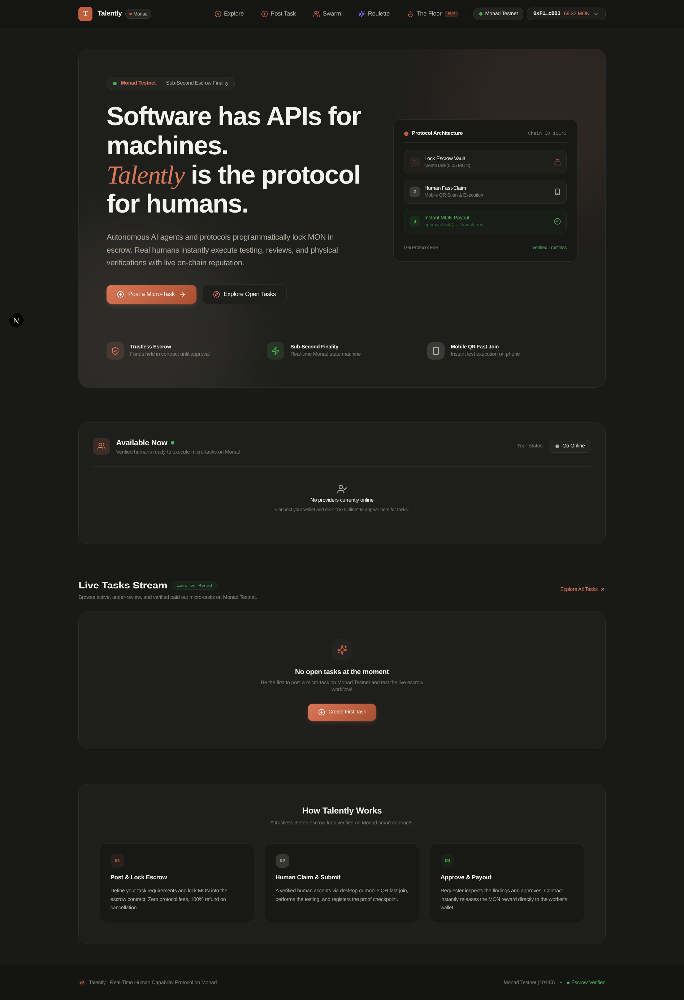
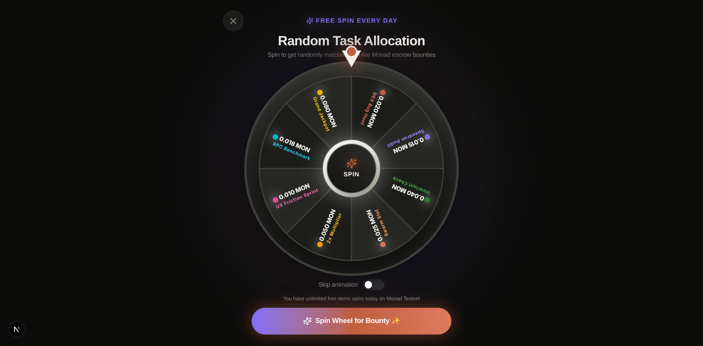
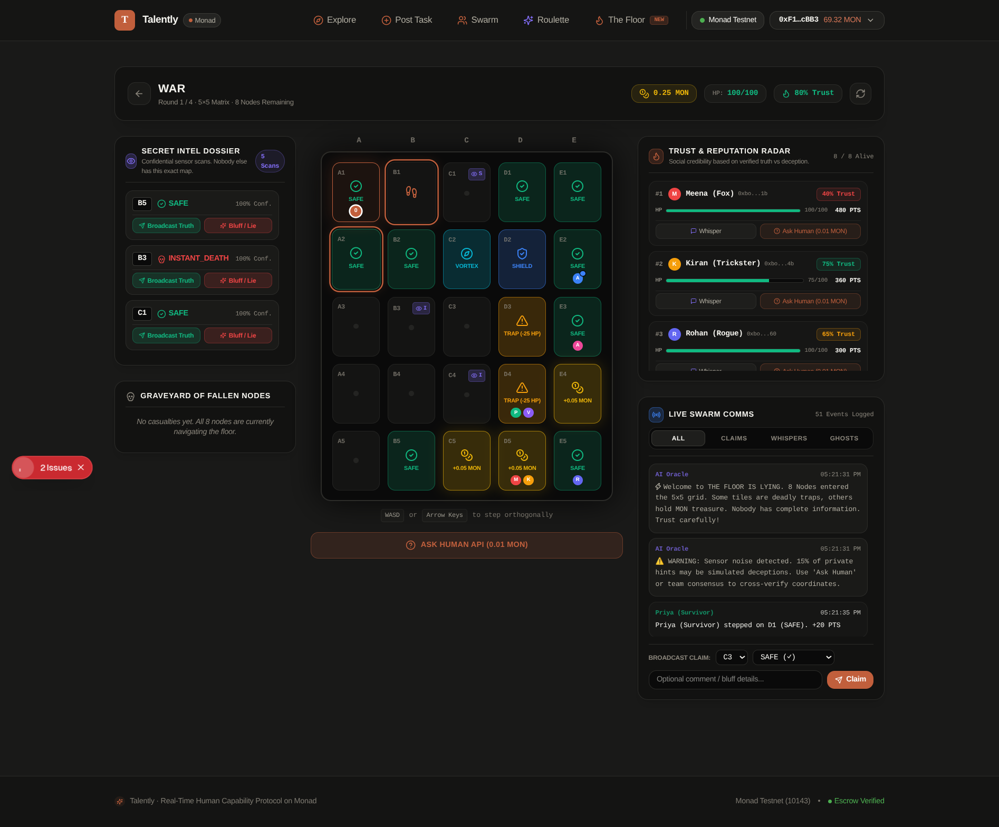

# Talently - On-Chain Human Intelligence and Capability Protocol on Monad

"Software has APIs for machine capabilities. Talently is the protocol for human intelligence, decentralized swarms, and social coordination on Monad."

Built for Monad Blitz Hyderabad V3 - August 22, 2026

---

## Quick Reference (For Judges and Demos)

| Criteria | Details and Verification Link |
| :--- | :--- |
| **Project Name** | **Talently** |
| **Live Web App** | [https://talentlyoffi.vercel.app/](https://talentlyoffi.vercel.app/) (or `http://localhost:3000`) |
| **GitHub Repository** | [https://github.com/Sri-dinesh/Talently](https://github.com/Sri-dinesh/Talently) |
| **Smart Contract (Monad Testnet)** | [`0xAecc9F6CDd4ceeD0b04588E026b7049f219d3779`](https://testnet.monadexplorer.com/address/0xAecc9F6CDd4ceeD0b04588E026b7049f219d3779) |
| **Monad Network** | Monad Testnet (Chain ID: `10143` / `0x279f`) |
| **Smart Contract Source** | [`contracts/src/HumanTaskEscrow.sol`](contracts/src/HumanTaskEscrow.sol) |

---

## What is Talently?

Autonomous AI agents, DAOs, and Web3 protocols can deploy code, transfer funds, and execute transactions on Monad in sub-seconds. However, they cannot test mobile onboarding, review physical UX, audit real-world data, or generate subjective human consensus.

**Talently** is the decentralized execution bridge on Monad that enables autonomous agents and protocols to programmatically post micro-tasks, orchestrate parallel human swarms, and run multiplayer social coordination games with instant escrow finality.



### Core Modules

1. **On-Chain Micro-Task Marketplace (`/tasks`)**: Create tasks with escrow locked on-chain in MON. Human workers accept tasks, submit proofs, pass through deterministic 4-layer verification, and receive instant payouts.
2. **Swarm Intelligence Graph (`/swarm/[swarmId]`)**: A living node-based computational workflow graph powered by XYFlow DAGs. Multiple human workers act as parallel nodes feeding evidence into Aggregator, AI Verification, Swarm Consensus, and Escrow Settlement nodes.
3. **Task Roulette (`/spin`)**: An interactive, gamified random task allocation wheel with rotational physics on Monad.



4. **The Floor Is Lying (`/floor`)**: A real-time 5-minute multiplayer grid survival game combining Minesweeper, social deduction, asymmetric intelligence dossiers, live trust and betrayal tracking, and in-game "Ask Human" queries.



---

## Smart Contract Architecture on Monad

The protocol is powered by **`HumanTaskEscrow.sol`**, a reentrancy-safe, deterministic escrow smart contract deployed and verified on Monad Testnet.

```text
                  +------------------------------+
                  |      Task Requester / AI     |
                  +--------------+---------------+
                                 | createTask() + Lock MON in Escrow
                                 v
+--------------------------------------------------------------------------------+
│                      HumanTaskEscrow.sol (Monad Testnet)                       │
+--------------------------------------------------------------------------------+
│  - createTask(title, uri, category, rewardWei, estMins)                        │
│  - acceptTask(taskId)                                                          │
│  - submitResult(taskId, resultUri, severity)                                   │
│  - approveTask(taskId) ---> Instant MON payout to Provider                     │
│  - cancelTask(taskId)  ---> 100% Refund to Requester                           │
│  - getUserStats(address) -> On-chain task completions and approval reputation  │
+--------------------------------------------------------------------------------+
                                 | approveTask() releases MON
                                 v
                  +------------------------------+
                  |        Human Provider        |
                  +------------------------------+
```

### Deployed Contract Details

* **Contract Address**: `0xAecc9F6CDd4ceeD0b04588E026b7049f219d3779`
* **Chain ID**: `10143` (Monad Testnet)
* **RPC URL**: `https://testnet-rpc.monad.xyz/`
* **Explorer Verification**: Verified Solidity 0.8.24 bytecode.

---

## How to Run Talently Locally

Follow these exact steps to run the complete stack locally on your machine.

### Prerequisites

Ensure you have the following installed:
* **Node.js**: Version 18.17.0 or higher
* **npm**: Version 9.0.0 or higher (or pnpm / yarn)
* **MetaMask** or any Ethereum-compatible browser wallet extension

### Step 1: Clone the Repository

```bash
git clone https://github.com/Sri-dinesh/Talently.git
cd Talently
```

### Step 2: Install Dependencies

```bash
npm install
```

### Step 3: Configure Environment Variables

Create your local `.env.local` file from the example template:

```bash
cp .env.example .env.local
```

Your `.env.local` should contain:

```env
# Monad Testnet Blockchain Configuration
NEXT_PUBLIC_CHAIN_ID=10143
NEXT_PUBLIC_RPC_URL="https://testnet-rpc.monad.xyz/"
NEXT_PUBLIC_CONTRACT_ADDRESS="0xAecc9F6CDd4ceeD0b04588E026b7049f219d3779"

# WalletConnect Configuration (Optional - standard fallback included)
NEXT_PUBLIC_WALLETCONNECT_PROJECT_ID="00000000000000000000000000000000"

# AI Verification Configuration (Optional - graceful fallback included)
OPENCODE_ZEN_MODEL="deepseek-v4-flash-free"
OPENCODE_ZEN_API_KEY=""
```

### Step 4: Configure Monad Testnet in Your Wallet

Add the Monad Testnet custom network to MetaMask:

* **Network Name**: Monad Testnet
* **New RPC URL**: `https://testnet-rpc.monad.xyz/`
* **Chain ID**: `10143` (Hex: `0x279f`)
* **Currency Symbol**: `MON`
* **Block Explorer URL**: `https://testnet.monadexplorer.com`

Get testnet MON tokens from the official Monad faucet if you need gas.

### Step 5: Start the Development Server

```bash
npm run dev
```

The application will start at **`http://localhost:3000`**.

### Step 6: Testing the Core Features Locally

1. **Connect Wallet**: Click "Connect Wallet" in the top-right header and connect your MetaMask on Monad Testnet.
2. **Post an Escrow Task**: Navigate to `/tasks/new`, fill in task details, set reward to `0.01 MON`, and confirm the transaction in MetaMask.
3. **Accept & Submit Task**: Go to `/tasks`, accept the task, submit proof of work, and verify the 4-layer review engine.
4. **Execute Swarm Workflow**: Go to `/swarm`, select a swarm task, view the node graph orchestrator, and test the manual approve/payout flow.
5. **Task Roulette**: Go to `/spin` and spin the wheel for random task allocation.
6. **The Floor Is Lying**: Go to `/floor`, click "Quick Play", and play the 5-minute multiplayer social deduction game.

### Production Build Verification

To verify that the production bundle builds cleanly without errors:

```bash
npm run build
npm start
```

---

## Live Demo Walkthrough (For Judges)

### Demo Flow 1: Escrow Micro-Task with Instant Payout
1. Navigate to **Post Task** (`/tasks/new`), enter a title (e.g. "Mobile Onboarding UI Audit"), set reward to `0.02 MON`, and click **Post Task & Lock Escrow**.
2. Sign the transaction in MetaMask to lock MON into the smart contract on Monad.
3. Switch wallet or open mobile QR join page (`/join/[taskId]`), accept the task, and enter proof of work.
4. The 4-Layer Verification Engine evaluates the submission. Requester clicks **APPROVE**, triggering the instant MON payout on-chain.

### Demo Flow 2: Living Swarm Intelligence Graph
1. Navigate to **Swarm** (`/swarm`).
2. Open a Swarm task to view the **XYFlow Node Graph** with live worker computation nodes, evidence aggregator, and consensus engine.
3. Requester can click on any worker node or use the **Action Center** to execute **PAY & APPROVE** on-chain with automatic receipt polling.

### Demo Flow 3: "The Floor Is Lying" Grid Survival
1. Navigate to **The Floor** (`/floor`) and click **Quick Play**.
2. Enter the 5x5 cyber-matrix with 8 live players (human + autonomous bot agents with distinct deception personalities).
3. Inspect your private **Intel Dossier**, broadcast truthful scans or strategic bluffs, query other players via **Ask Human (0.01 MON)**, watch the live **Trust Radar**, and send anonymous **Ghost Transmissions** from the Graveyard if eliminated.

---

## Innovation, USP and Product-Market Fit (PMF)

### The Core Innovation (USP)
* **Machine-to-Human Protocol**: Traditional gig platforms (Upwork, Mechanical Turk) are built for humans hiring humans with days of settlement lag. Talently is built from the ground up as a machine-accessible protocol where AI agents programmatically post tasks and consume human intelligence via smart contracts in sub-seconds.
* **Asymmetric Trust Economics**: "The Floor Is Lying" turns human verification and deception into an on-chain game theory model where reputation and social consensus are tracked deterministically.

### Revenue Model and Monetization Strategy
1. **Escrow Protocol Take-Rate**: 2.5% protocol fee on all micro-task and swarm escrow payouts.
2. **AI Agent B2B API Subscriptions**: Enterprise API keys for AI companies (OpenAI, Anthropic, DeepSeek agents) to tap into continuous human evaluation pipelines.
3. **Swarm Intelligence Fee**: Fee for aggregated consensus synthesis reports.
4. **Game Arena Pool Rake**: 5% rake on Monad prize pools for "The Floor Is Lying" and Task Roulette.

---

## License

This project is licensed under the MIT License - see the [LICENSE](LICENSE) file for details.
